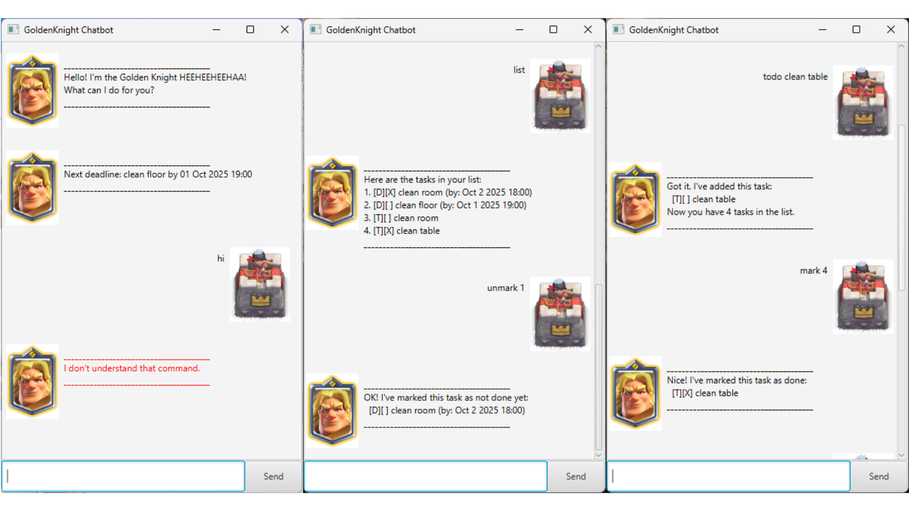

# GoldenKnight User Guide



GoldenKnight Chat is your personal **task management chatbot assistant** 🛡️.  
It helps you keep track of tasks, deadlines, events, and reminders, all from the convenience of a 
Command Line Interface (CLI) with a simple Graphical User Interface (GUI).

## Adding Todo Tasks

GoldenKnight includes a specialized task type called **Todo**,
which represents a task without a specific deadline.

Example: `todo buy groceries`

When you add a todo task using the command above, GoldenKnight will:
1. Confirm that the task has been added.
2. Display the task with its type, status, and description.
3. Show the total number of tasks currently in your list.

```
_______________________________________
Got it! I've added this task:
  [T][ ] buy groceries
Now you have 1 task in the list.
_______________________________________
```


## Adding Deadline Tasks

GoldenKnight includes a specialized task type called **Deadline**, 
which represents a task that must be completed by a specific date and time.

Example: `deadline clean table /by 2/10/2025 1800`

When you add a deadline task using the command above, GoldenKnight will:
1. Confirm that the task has been added. 
2. Display the task with its type, status, description, and formatted deadline. 
3. Show the total number of tasks currently in your list.

```
_______________________________________
Got it! I've added this task:
  [D][ ] clean table (by: Oct 2 2025 18:00)
Now you have 2 task in the list.
_______________________________________
```

## Adding Event Tasks

GoldenKnight includes a specialized task type called **Event**,
which represents a task that must be completed within a specific date and time period.

Example: `event clean room /from 2/10/2025 1600 /to 2/10/2025 2000`

When you add an event task using the command above, GoldenKnight will:
1. Confirm that the task has been added.
2. Display the task with its type, status, description, and formatted duration.
3. Show the total number of tasks in your list.

```
_______________________________________
Got it! I've added this task:
  [E][ ] clean room (from: Oct 2 2025 16:00 to: Oct 2 2025 20:00)
Now you have 3 task in the list.
_______________________________________
```

## Marking Task

GoldenKnight allows you to mark any task as completed, which updates it status from [ ] to [X].

Example: `mark 1`

When you mark a task as done, GoldenKnight will:
1. Confirm that the task has been marked completed.
2. Update the status icon from [ ] to [X].

```
_______________________________________
Nice! I've marked this task as done:
  [T][X] buy groceries
_______________________________________
```

## Unmarking Task

GoldenKnight allows you to unmark any task as uncompleted, which updates its status from [X] to [ ].

Example: `unmark 1`

When you unmark a task to be undone, GoldenKnight will:
1. Confirm that the task has been marked as uncompleted.
2. Update the status icon from [X] to [ ].

```
_______________________________________
Nice! I've marked this task as done:
  [T][ ] buy groceries
_______________________________________
```

## Viewing List

GoldenKnight allows you to view all the tasks in your list, showing the type, status,
description and any deadline or event time for each task.

Example: `list`

When you list your tasks, GoldenKnight will:
1. Display all tasks in the order they were added.
2. Show the task type ([T], [D] or [E]), completion status, description and time if applicable.

```
_______________________________________
Here are your tasks:
1. [T][ ] buy groceries
2. [D][ ] clean table (by: Oct 2 2025 18:00)
3. [E][ ] clean room (from: Oct 2 2025 16:00 to: Oct 2 2025 20:00)
_______________________________________
```

## Deleting Tasks

GoldenKnight allows you to remove tasks from your task list.

Example: `delete 2`

When you delete a task, GoldenKnight will:
1. Confirm that the task has been removed.
2. Display the task that was deleted.
3. Show the updated total number of tasks remaining in your list.

```
_______________________________________
Noted. I've removed this task:
  [D][ ] clean table (by: Oct 2 2025 18:00)
Now you have 2 tasks in the list.
_______________________________________
```

## Find Keywords

GoldenKnight allows you to search for tasks that contain specific keywords in their description.

Example: `find clean`

When you use the find command, GoldenKnight will:
1. Search through all tasks in your current list.
2. Display only the tasks that match they keyword(s).
3. Show the task type, status, description and time if applicable.

```
_______________________________________
Here are the matching tasks in your list:
1. [D][ ] clean table (by: Oct 2 2025 18:00)
2. [E][ ] clean room (by: Oct 2 2025 16:00 to: Oct 2 2025 20:00)
_______________________________________
```

## Exiting the Application

To exit the app, please click the `x` button in the top-right corner of the application window.

## Known Issues

1. Using the command `bye` does not bring the user out of the application. The remedy is to link this command
to exiting this application.

## Command Summary

| Action                | Format / Arguments                    | Example Usage                                              | Description                                    |
|-----------------------|---------------------------------------|------------------------------------------------------------|------------------------------------------------|
| **Add Todo Task**     | `todo TASK_NAME`                      | `todo clean room`                                          | Adds a Todo task with optional tags            |
| **Add Deadline Task** | `deadline TASK_NAME /by TIME`         | `deadline clean room 2/10/2025 1800`                       | Adds a Deadline task with optional tags        |
| **Add Event Task**    | `event TASK_NAME /from TIME /to TIME` | `event clean room /from 2/10/2025 1600 /to 2/10/2025 2000` | Adds an Event task with optional tags          |
| **Mark Task Done**    | `mark INDEX`                          | `mark 1`                                                   | Marks the task at the given index as completed |
| **Unmark Task Done**  | `unmark INDEX`                        | `unmark 1`                                                 | Unmarks the task at the given index            |
| **List Tasks**        | `list`                                | `list`                                                     | Shows all tasks in the current list            |
| **Delete Task**       | `delete INDEX`                        | `delete 2`                                                 | Deletes the task at the given index            |
| **Find Tasks**        | `find KEYWORD`                        | `find homework report`                                     | Finds tasks that contain the keyword(s)        |
| **Exit**              | `bye`                                 | `bye`                                                      | Exits GoldenKnight Chat                        |
